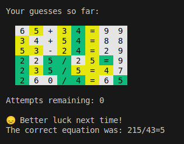

<!-- 
   Assignment Notes:
   - To run the game, execute `python3 nerdle.py` in the terminal.
   - Your task is to implement the equation generation functions in `equation_generator.py` and the solution validator in `game_engine.py`.
   - Don't forget to import your modules.
   - PAY ATTENTION TO THE TODO COMMENTS IN THE CODE.
   - Each function has comments detailing its purpose and requirements.
   - Code is automatically tested *every time* you push changes to GitHub.
-->

# Nerdle 🧮

A fun mathematical twist on Wordle! Instead of guessing words, you need to figure out an 8-character equation like `12+34=46` or `3*34=102`. Put your math skills to the test in this engaging puzzle game.



## Game Features

- **Mathematical Wordle**: Guess equations instead of words
- **8-character format**: All equations will have exactly 8 characters without spaces
- **Smart feedback**: Get hints about correct numbers and positions
- **6 attempts**: You have 6 guesses to solve each puzzle
- **Valid equations only**: Only mathematically correct equations are accepted

## Getting Started

### Requirements
- Python 3.8 or higher
- No external packages needed!

### Quick Start

1. **Download the game:**
```bash
git clone <repo-url>
cd nerdle-leoke599
```

2. **Run the game:**
```bash
python3 nerdle.py
```

That's it! Start guessing equations and have fun! 🎯

## How to Play

🎯 **Objective**: Guess the hidden 8-character mathematical equation

### Game Rules
- You have **6 attempts** to guess the correct equation
- Each equation is exactly **8 characters** long (like `12+34=46` dont include spaces)
- Only valid mathematical equations are accepted
- Only one operator for every equation (`6*5-2=28` will not work)
- After each guess, you'll get feedback on your numbers and their positions

### Example Equations
- `12+34=46` (addition)
- `3*34=102` (multiplication)
- `252/36=7` (division)
- `56-23=33` (subtraction)

### Feedback System
Just like Wordle, you'll get hints after each guess:
- **Green**: Right number in the right position
- **Yellow**: Right number but wrong position  
- **White**: Number not in the equation